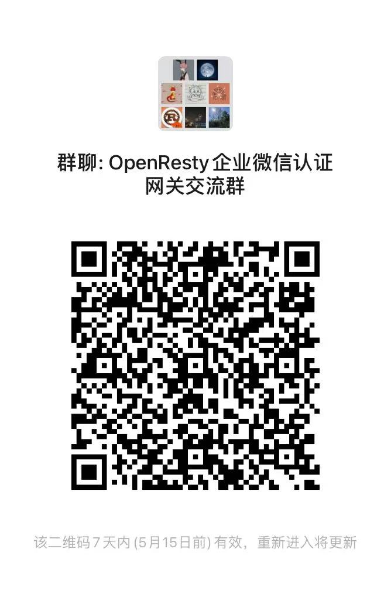

# lua-resty-weauth

适用于 OpenResty / ngx_lua 的基于企业微信组织架构的登录认证

## 使用

### 安装 OpenResty

参考: https://k8scat.com/posts/linux/install-openresty-on-ubuntu-from-source-code/

### 下载

```bash
cd /usr/local/openresty/site/lualib
git clone https://github.com/k8scat/lua-resty-http.git
git clone https://github.com/k8scat/lua-resty-jwt.git
git clone https://github.com/k8scat/lua-resty-weauth.git
```

### 配置

#### http 配置

```conf
http {
    lua_package_path "/usr/local/openresty/site/lualib/lua-resty-weauth/lib/?.lua;/usr/local/openresty/site/lualib/lua-resty-jwt/lib/?.lua;/usr/local/openresty/site/lualib/lua-resty-jwt/vendor/?.lua;/usr/local/openresty/site/lualib/lua-resty-http/lib/?.lua;;";
}
```

#### server 配置

```
server {
    listen 443 ssl;
    server_name weauth.example.com;
    resolver 8.8.8.8; # 调用企业微信接口需要设置 DNS
    
    ssl_certificate /usr/local/openresty/cert/weauth.example.com.crt;
    ssl_certificate_key /usr/local/openresty/cert/weauth.example.com.key;
    ssl_session_cache shared:SSL:1m;
    ssl_session_timeout 5m;
    ssl_protocols TLSv1 TLSv1.1 TLSv1.2;
    ssl_ciphers AESGCM:HIGH:!aNULL:!MD5;
    ssl_prefer_server_ciphers  on;
    lua_ssl_verify_depth 2;
    lua_ssl_trusted_certificate /etc/pki/tls/certs/ca-bundle.crt;
    if ($time_iso8601 ~ "^(\d{4})-(\d{2})-(\d{2})T(\d{2})") {
        set $year $1;
        set $month $2;
        set $day $3;
    }
    access_log logs/weauth.example.com_access_$year$month$day.log main;
    error_log logs/weauth.example.com_error_$year$month$day.log;

    access_by_lua_block {
        local weauth = require "resty.weauth"
        weauth.corp_id = ""
        weauth.app_agent_id = ""
        weauth.app_secret = ""
        weauth.callback_uri = "/weauth_callback"
        weauth.logout_uri = "/weauth_logout"
        weauth.app_domain = "weauth.example.com"

        weauth.jwt_secret = "thisisjwtsecret"

        weauth.ip_blacklist = {"47.1.2.3"}
        weauth.uri_whitelist = {"/"}
        weauth.department_whitelist = {1, 2}

        weauth:auth()
    }
    
    location / {
        root /data/www;
    }
}

server {
    listen 80;
    server_name weauth.example.com;

    location / {
        rewrite ^/(.*) https://$server_name/$1 redirect;
    }
}
```

配置说明：

- `corp_id` 用于设置企业 ID
- `app_agent_id` 用于设置企业微信自建应用的 `AgentId`
- `app_secret` 用于设置企业微信自建应用的 `Secret`
- `callback_uri` 用于设置企业微信扫码登录后的回调地址（需设置企业微信授权登录中的授权回调域）
- `logout_uri` 用于设置登出地址
- `app_domain` 用于设置访问域名（需和业务服务的访问域名一致）
- `jwt_secret` 用于设置 JWT secret
- `ip_blacklist` 用于设置 IP 黑名单
- `uri_whitelist` 用于设置地址白名单，例如首页不需要登录认证
- `department_whitelist` 用于设置部门白名单（数字），默认不限制部门

## 依赖模块

- [lua-resty-http](https://github.com/ledgetech/lua-resty-http)
- [lua-resty-jwt](https://github.com/SkyLothar/lua-resty-jwt)

## 相关项目

- [lua-resty-feishu-auth](https://github.com/k8scat/lua-resty-feishu-auth) 适用于 OpenResty / ngx_lua 的基于[飞书](https://www.feishu.cn/)组织架构的登录认证

## 作者

[K8sCat](https://k8scat.com) <k8scat@gmail.com>

## 开源协议

[MIT](./LICENSE)

## 交流群



> 二维码失效可添加微信 「kennn007」，请备注「lua-resty-weauth」。
